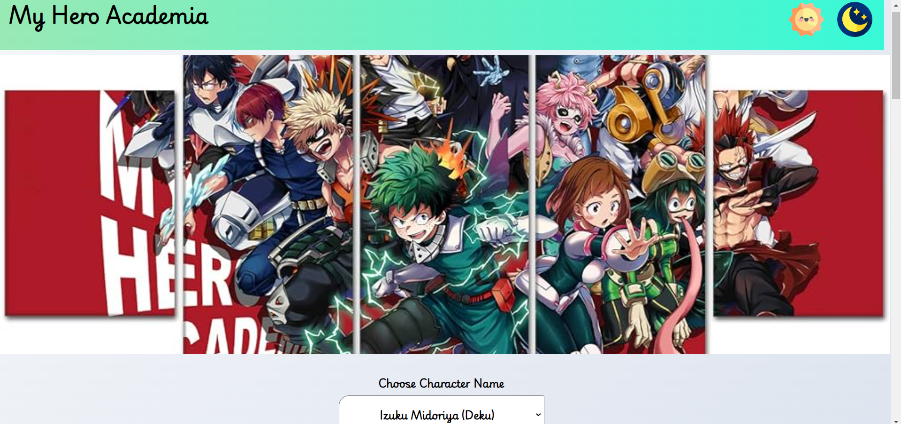

# Myheroacedmia✨

Welcome to Myheroacedmia, your ultimate hub for anime enthusiasts! Dive into a world of detailed character profiles, fascinating facts, and in-depth information about your favorite anime series. Discover everything from the origins of iconic characters to lesser-known trivia that will deepen your appreciation for anime culture.

## Web-Site Link 🎉
[MyHeroAcedmia](https://myheroacedmia.netlify.app/)

## Features

- **Character Database:** Explore comprehensive profiles of anime characters, including their backgrounds, abilities, and story arcs.
- **Interesting Facts:** Uncover intriguing tidbits and trivia about anime series and characters that will surprise even the most dedicated fans.
- **Collectibles and Merchandise:** Browse through a curated collection of action figures, merchandise, clothing, and anime-themed laptop stickers to enrich your fandom experience.
- **Community:** Join a vibrant community of anime lovers to discuss your favorite shows, share recommendations, and connect with fellow enthusiasts.

## How to Use

1. **Explore Characters:** Use the search function or browse categories to find information about specific anime characters.
2. **Discover Facts:** Check out the "Did You Know?" section for interesting insights and trivia.
3. **Shop Merchandise:** Visit the store section to browse and purchase anime-related collectibles and merchandise.
   

## Contribution

Contributions are welcome! If you'd like to add new character profiles, interesting facts, or suggest improvements, please feel free to submit a pull request.

## Feedback

We value your feedback! If you have any suggestions, questions, or just want to say hello, reach out to us through [contact information].

Enjoy exploring the world of anime with Myheroacedmia!
